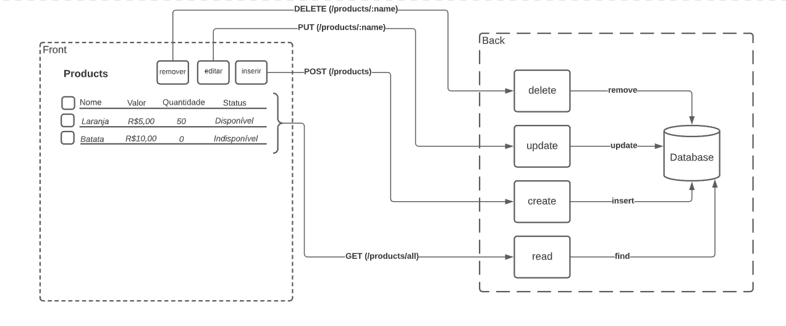

# Teste Full Stack

Olá!

Este repositório é onde iremos desenvolver o nosso teste que trata-se de um cadastro de produtos. Observe que as pastas estão organizadas em back e front, isso é para organizamos cada desenvolvimento de forma separada. A seguir está descrito melhor o que esperamos dentro de cada uma destas pastas.

## Estrutura



-----

## Back

É onde iremos desenvolver nossas APIs que iram prover as mecânicas necessárias para o funcionamento da nossa interface.

**Requisitos** 

- Deverá ser capaz de alterar uma produto existente.
- Deverá ser capaz de deletar um produto existe.
- Deverá ser capaz de inserir um novo produto.
  - O nome do produto não deverá ter menos que 3 caracteres.
  - O valor do produto deverá ser maior que 0.
  - A quantidade do produto deverá ser maior que 0.
- Todos os dados devem ser persistidos em uma base de dados (podemos considerar memória e arquivo como uma base da dados)
- Testes automatizados.

**Desejáveis** 

- Schemas de validação
- Autenticação para garantia de segurança da API.
- Uso de MONGODB.

**Execução**

Rodar testes

```
  npm run test
```

Iniciar aplicação

```
  npm start
```


-----

## Front

É onde iremos implementar um interface onde é possível listar os produtos, cadastrar novos, editar e deletar se comunicando constantemente com as APIs do back end.

**Requisitos** 

- Listar produtos (nome, valor, quantidade, estado (disponível/indisponível))
- Mudar a cor dos botões
- Centralizar o conteúdo da página deixando espaçamento lateral
- Implementar o formulário de cadastro e edição
- Permitir deletar

**Desejáveis**

- Testes automatizados.

**Execução**

Iniciar aplicação

```
  npm start
```

Rodar os testes

```
  npm run test
```

-----

## Observações

- Fique a vontade para usar a criatividade, gostamos muito de ver coisas novas.
- Quando dizemos desejável estamos falando de algo que gostariamos de ver mas não é essêncial.
- O projeto já vai com uma casca funcional dentro das pastas back(NODEJS) e front(REACT), o propósito é ajudar a nortear o desenvolvimento.
- Mude o que quiser.


Boa Sorte!